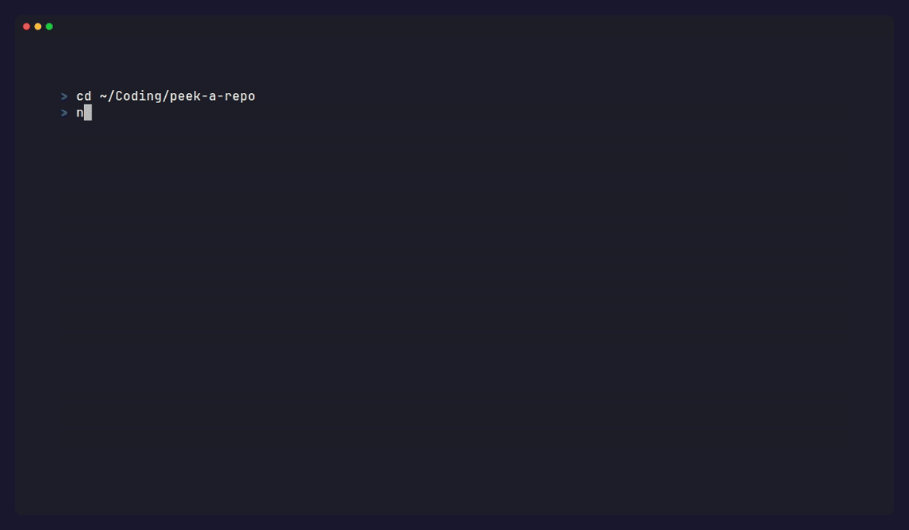

# stale-branches

[](https://www.npmjs.com/package/stale-branches)
[](https://www.npmjs.com/package/stale-branches)
[](https://github.com/xevrion/stale-branches/actions/workflows/ci.yml)
[](./LICENSE)

Interactive CLI to list and delete stale git branches. Shows each branch's age, merge status, and last commit — then lets you delete them all in one session, local and remote.

→ [xevrion.github.io/stale-branches](https://xevrion.github.io/stale-branches)

## Features

- **Branch table** — age, merge status, last commit shown before the interactive prompt
- **Merged pre-selected** — safe defaults; unmerged branches shown in red and require an extra confirmation
- **Local + remote** — cleans up both in one pass, asks per-branch or use `--remote` to skip prompts
- **Protected branches** — never touches `main`, `master`, `develop`, `dev`, `staging`, `production`, or your current branch
- **Command injection prevention** — branch names are sanitized before any `git` call
- **--dry-run** — preview exactly what would be deleted without touching anything

```
npx stale-branches
```

## What it looks like



## Install

```bash
# Run without installing
npx stale-branches

# Or install globally
npm install -g stale-branches
```

## Usage

```bash
# Interactive mode — shows all non-protected branches
stale-branches

# Only show merged branches
stale-branches --merged

# Only show branches older than 30 days
stale-branches --days 30

# Preview what would be deleted without actually deleting
stale-branches --dry-run

# Delete remote branches without asking
stale-branches --remote
```

## Flags

| Flag | Description |
|------|-------------|
| `--merged` | Show only merged branches |
| `--dry-run` | Print what would be deleted, don't delete anything |
| `--days <n>` | Only show branches older than n days (default: 0) |
| `--remote` | Delete remote branches automatically without confirmation |

## Behaviour

- **Protected branches** — never shown or touched: `main`, `master`, `develop`, `dev`, `staging`, `production`, and your currently checked-out branch
- **Merged branches** — pre-selected by default (safe to delete)
- **Unmerged branches** — shown in red, not pre-selected, require an extra confirmation prompt
- **Remote deletion** — asked once for all selected branches that have remotes, unless `--remote` is passed
- **Branch names** — sanitized before passing to git to prevent command injection

## Requirements

- Node.js >= 20
- Git

## License

MIT
